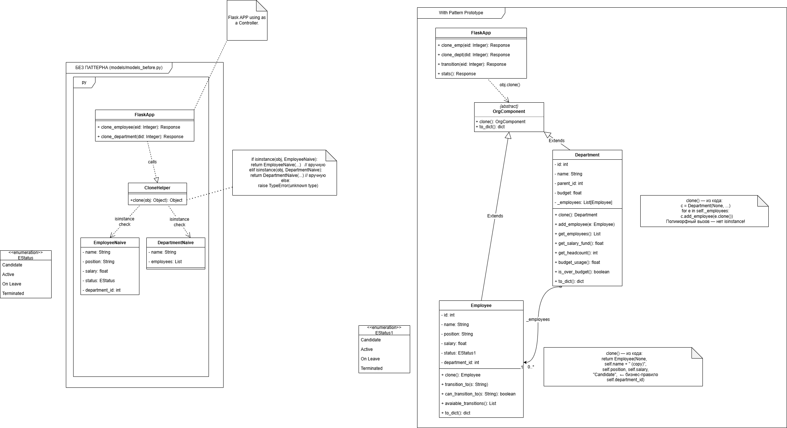
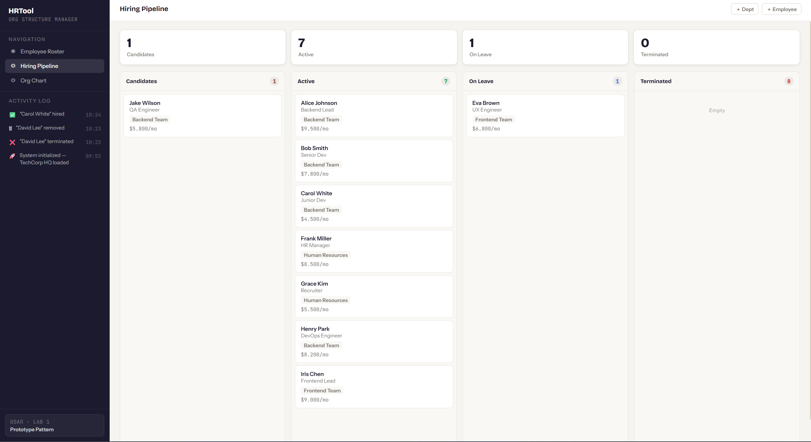

# ЛАБОРАТОРНАЯ РАБОТА № 1
**Паттерн проектирования:** Прототип (Prototype)
**Дисциплина:** Объектно-ориентированный анализ и проектирование (ООАП)
**Приложение:** HR Tool — Система управления персоналом (Flask, Python)
**Live Demo:** https://umut.ipmkn.ru

## 1. Описание проблемы
Система управления персоналом HR Tool должна поддерживать создание новых сотрудников и отделов на основе уже существующих — иными словами, клонирование объектов как шаблонов. 

Типичные сценарии использования:
* Нанять нового разработчика на ту же должность, что и существующий сотрудник (скопировать должность и зарплату).
* Развернуть новый отдел с той же структурой, что и уже существующий (скопировать отдел вместе с составом).
* Использовать сотрудника как шаблон найма — сохранить должность и зарплату, но сбросить статус на «Candidate».

Реализация без паттерна (`models_before.py`) демонстрирует проблему: клиентская функция `clone_naive()` вынуждена проверять конкретный тип объекта через `isinstance`:

```python
def clone_naive(obj):
    if isinstance(obj, EmployeeNaive):
        return EmployeeNaive(name+' (copy)', ...)
    elif isinstance(obj, DepartmentNaive):
        return DepartmentNaive(name+' (copy)', ...)
    else: 
        raise TypeError("unknown type")

```

Данный подход порождает следующие проблемы:

* Клиентский код зависит от всех конкретных классов — нарушение принципа инверсии зависимостей.
* Бизнес-правило (сброс статуса в 'Candidate') размещено в клиентском коде, а не внутри класса.
* Добавление нового типа (например, Contractor) требует изменения функции `clone_naive()` — нарушение принципа открытости/закрытости (OCP).
* Масштабирование системы приводит к разрастанию ветвей `isinstance` и ошибкам.

## 2. Решение: применение паттерна Прототип

### 2.1 Структура паттерна

Паттерн Прототип (Prototype) предоставляет объектам интерфейс для клонирования самих себя. Клиент вызывает `obj.clone()` не зная конкретного типа объекта — каждый класс несёт ответственность за собственное копирование.

В проекте введён абстрактный базовый класс `OrgComponent` (`models/prototype.py`), определяющий единственный контракт:

```python
class OrgComponent:
    def clone(self): raise NotImplementedError
    def to_dict(self): raise NotImplementedError

```

### 2.2 Конкретный прототип — Employee

Класс `Employee` (`models/employee.py`) реализует `clone()` как создание нового объекта с теми же профессиональными полями (должность, зарплата), но с обнулённым статусом. Бизнес-правило инкапсулировано внутри класса:

```python
def clone(self):
    return Employee(
        emp_id=None,
        name=self.name + ' (copy)',
        position=self.position,
        salary=self.salary,
        status='Candidate',  # <-- Бизнес-правило внутри класса
        department_id=self.department_id
    )

```

### 2.3 Конкретный прототип — Department

Класс `Department` (`models/department.py`) клонирует себя вместе с плоским списком сотрудников. Каждый сотрудник клонируется полиморфно через свой собственный `clone()`:

```python
def clone(self):
    c = Department(None, self.name+' (copy)', self.parent_id, self.budget)
    for e in self._employees:
        c.add_employee(e.clone())  # Полиморфный вызов — не isinstance!
    return c

```

### 2.4 Клиент — FlaskApp

Контроллер Flask (`app.py`) вызывает `obj.clone()` без проверки конкретного типа. Маршруты `/api/clone/employee/<id>` и `/api/clone/department/<id>` работают одинаково для любого объекта, реализующего `OrgComponent`:

```python
# clone_emp(eid)
emp = find_employee(eid)
cloned = emp.clone()         # ← Прототип (паттерн)
cloned.id = new_id()
employees.append(cloned)

# clone_dept(did)
dept = find_department(did)
cloned = dept.clone()        # ← Прототип (паттерн)

```

## 3. Диаграммы классов

На Рисунке 1 изображена архитектура приложения без паттерна: функция `clone_naive()` зависит от конкретных типов через `isinstance`. На Рисунке 2 изображена архитектура с применением паттерна Прототип: каждый класс реализует `clone()` самостоятельно, клиент работает с абстракцией `OrgComponent`.




## 4. Сравнение подходов

| Критерий | Без паттерна | С паттерном Прототип |
| --- | --- | --- |
| **Клонирование** | `clone_naive(obj)` с `isinstance` — клиент знает все типы | `obj.clone()` — каждый объект клонирует себя сам |
| **Бизнес-правило** | Статус сбрасывается в `clone_naive()` — вне класса | Статус сбрасывается внутри `Employee.clone()` |
| **Добавить тип** | Необходимо изменить `clone_naive()` — нарушает OCP | Новый класс реализует `clone()` — ничего не меняется |
| **Зависимость** | Клиент зависит от `EmployeeNaive`, `DepartmentNaive` | Клиент зависит только от `OrgComponent` (абстракция) |
| **Полиморфизм** | Отсутствует — ветвление if/elif | Полный — единый вызов для любого типа |

## 5. Вывод

Применение паттерна Прототип в HR Tool позволило устранить зависимость клиентского кода от конкретных типов объектов. Вместо функции с ветвлениями `isinstance` каждый класс несёт ответственность за собственное клонирование.

Паттерн дал следующие конкретные улучшения:

* **Инкапсуляция бизнес-правила:** сброс статуса сотрудника в 'Candidate' перенесён внутрь `Employee.clone()`, что исключает возможность его обхода клиентом.
* **Соблюдение Open/Closed Principle (OCP):** добавление нового типа объекта (например, Contractor) не требует изменения существующего кода — достаточно реализовать `clone()`.
* **Полиморфизм:** FlaskApp вызывает `obj.clone()` единообразно для `Employee` и `Department`, не зная конкретного типа.
* `Department.clone()` клонирует весь состав отдела, вызывая `e.clone()` для каждого сотрудника полиморфно — без единого `isinstance`.

Код стал более читаемым, тестируемым и расширяемым.

**

Паттерн Прототип особенно эффективен в данном приложении, поскольку создание сотрудников и отделов на основе существующих шаблонов является центральным функциональным требованием системы.

```

```