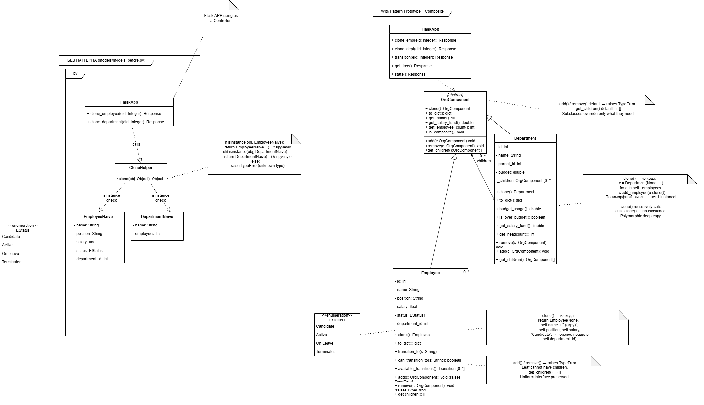

# ЛАБОРАТОРНАЯ РАБОТА № 2
**Паттерн проектирования:** Компоновщик (Composite)
**Дисциплина:** Объектно-ориентированный анализ и проектирование (ООАП)
**Приложение:** HR Tool — Система управления персоналом (Flask, Python)
**Live Demo:** https://umut.ipmkn.ru

## 1. Описание проблемы

Система HR Tool работает с иерархической структурой: компания содержит отделы, отделы содержат подотделы и сотрудников. Глубина дерева произвольна — `TechCorp HQ` → `Engineering` → `Backend Team` → сотрудники.

Типичные операции, которые должны работать для любого узла дерева:
* Подсчитать фонд зарплат всего отдела вместе с вложенными подотделами.
* Обойти дерево и построить JSON-представление (`/api/tree`).
* Глубоко клонировать отдел вместе со всей вложенной структурой.

Реализация без паттерна требует проверки конкретного типа на каждом уровне обхода:

```python
def get_salary_fund(node):
    if isinstance(node, Department):
        total = 0
        for child in node.children:
            if isinstance(child, Department):
                total += get_salary_fund(child)   # рекурсия
            elif isinstance(child, Employee):
                total += child.salary
        return total
    elif isinstance(node, Employee):
        return node.salary
```

Данный подход порождает следующие проблемы:

* Каждая операция обхода (подсчёт зарплат, количества сотрудников, клонирование) содержит собственную цепочку `isinstance` — дублирование кода.
* Добавление нового типа узла (например, `Contractor`) требует изменения каждой такой функции — нарушение Open/Closed Principle.
* `Department.clone()` из Лабораторной № 1 не может рекурсивно обойти поддерево без `isinstance`, так как интерфейс обхода не определён в базовом классе.
* Клиентский код (`FlaskApp`) вынужден знать о конкретных типах узлов — нарушение принципа инверсии зависимостей.

## 2. Решение: применение паттерна Компоновщик

### 2.1 Структура паттерна

Паттерн Компоновщик (Composite) предоставляет единый интерфейс для листовых и составных узлов дерева. Клиент работает с любым узлом одинаково, не зная, является ли он листом или ветвью.

В проекте абстрактный базовый класс `OrgComponent` (`models/prototype.py`) расширен интерфейсом обхода дерева:

```python
class OrgComponent:
    # Prototype (Лаб. № 1)
    def clone(self): raise NotImplementedError
    def to_dict(self): raise NotImplementedError

    # Composite interface (Лаб. № 2) — новое
    def add(self, component: "OrgComponent"):
        raise TypeError(f"{self.__class__.__name__} is a leaf — cannot add children")

    def remove(self, component: "OrgComponent"):
        raise TypeError(f"{self.__class__.__name__} is a leaf — cannot remove children")

    def get_children(self) -> list:
        return []
```

По умолчанию `add()` и `remove()` бросают `TypeError`, а `get_children()` возвращает пустой список — это поведение листа. Составные узлы переопределяют эти методы.

### 2.2 Листовой узел — Employee

Класс `Employee` (`models/employee.py`) является листом дерева. Он наследует поведение по умолчанию из `OrgComponent` и явно переопределяет заглушки, документируя контракт:

```python
# Composite — Leaf stubs
def add(self, component: OrgComponent):
    raise TypeError("Employee is a leaf node — cannot add children")

def remove(self, component: OrgComponent):
    raise TypeError("Employee is a leaf node — cannot remove children")

def get_children(self) -> list:
    return []   # Лист — единый интерфейс, не isinstance
```

`get_children()` возвращает пустой список, а не бросает исключение — это принципиально. Любой код обхода может вызвать `node.get_children()` для любого узла и просто получить пустой список для сотрудника, не нуждаясь в проверке типа.

### 2.3 Составной узел — Department

Класс `Department` (`models/department.py`) является ветвью дерева. Он реализует все три метода Composite по-настоящему:

```python
def add(self, component: OrgComponent):
    self._children.append(component)

def remove(self, component: OrgComponent):
    self._children.remove(component)

def get_children(self) -> list:
    return list(self._children)
```

Ключевой момент: `_children` содержит объекты типа `OrgComponent` — то есть внутри отдела могут находиться как `Employee`, так и другие `Department`. Операции над деревом работают рекурсивно без единого `isinstance`:

```python
def get_salary_fund(self):
    return sum(c.get_salary_fund() for c in self._children)  # полиморфизм

def get_employee_count(self):
    return sum(c.get_employee_count() for c in self._children)
```

### 2.4 Взаимодействие с паттерном Прототип

Паттерн Компоновщик усиливает реализацию `clone()` из Лабораторной № 1. Метод `Department.clone()` теперь обходит поддерево через `get_children()`, а не через прямой доступ к внутреннему списку:

```python
def clone(self):
    cloned = Department(
        dept_id=None,
        name=self.name + " (copy)",
        parent_id=self.parent_id,
        budget=self.budget,
    )
    for child in self.get_children():   # ← Composite interface
        cloned.add(child.clone())       # ← Prototype — полиморфный вызов
    return cloned
```

Один вызов `dept.clone()` рекурсивно обходит всё поддерево произвольной глубины. Если дочерний узел — `Department`, вызывается его `clone()`, который снова использует `get_children()`. Если `Employee` — вызывается его `clone()`, который возвращает нового сотрудника со сброшенным статусом. Нигде нет `isinstance`.

### 2.5 Клиент — FlaskApp

Контроллер Flask (`app.py`) строит дерево и обходит его исключительно через интерфейс `OrgComponent`. Функция `build_tree()` добавляет дочерние узлы через `add()`, не зная их конкретного типа:

```python
def build_tree():
    dmap = {d.id: d for d in _departments}
    for d in _departments:
        d._children = []
    for e in _employees:
        if e.department_id and e.department_id in dmap:
            dmap[e.department_id].add(e)      # ← Composite
    for d in _departments:
        if d.parent_id and d.parent_id in dmap:
            dmap[d.parent_id].add(d)          # ← Composite
    return [d for d in _departments if d.parent_id is None]
```

Маршрут `/api/clone/department/<id>` клонирует всё поддерево через единый полиморфный вызов:

```python
cloned = dept.clone()    # ← Prototype + Composite совместно
```

## 3. Диаграммы классов

На Рисунке 1 изображена архитектура без паттерна: функции обхода зависят от конкретных типов через `isinstance`. На Рисунке 2 изображена архитектура с паттерном Компоновщик: `OrgComponent` определяет единый интерфейс, клиент не знает конкретного типа узла.



## 4. Сравнение подходов

| Критерий | Без паттерна | С паттерном Компоновщик |
| --- | --- | --- |
| **Обход дерева** | `isinstance` на каждом уровне | `node.get_children()` — единый интерфейс |
| **Добавить тип** | Изменить все функции обхода | Новый класс реализует `get_children()` |
| **Клонирование** | Прямой доступ к полям, не работает для вложенных отделов | `get_children()` + `child.clone()` — произвольная глубина |
| **Зависимость** | Клиент зависит от `Employee`, `Department` | Клиент зависит только от `OrgComponent` |
| **Полиморфизм** | Отсутствует — ветвление `if/elif` | Полный — единый вызов для листа и ветви |

## 5. Вывод

Применение паттерна Компоновщик в HR Tool позволило устранить зависимость кода обхода от конкретных типов узлов. Вместо функций с цепочками `isinstance` каждый класс сам отвечает за возврат своих дочерних элементов.

Паттерн дал следующие конкретные улучшения:

* **Единый интерфейс обхода:** `get_salary_fund()`, `get_employee_count()` и `to_dict()` в `Department` реализованы через `self._children` полиморфно — ни одного `isinstance`.
* **Усиление паттерна Прототип:** `Department.clone()` использует `get_children()` для рекурсивного обхода, что делает глубокое клонирование корректным для дерева произвольной глубины.
* **Соблюдение Open/Closed Principle:** добавление нового типа узла (например, `Contractor`) не требует изменения ни одной функции обхода — достаточно реализовать `get_children()`, `get_salary_fund()` и `clone()`.
* **Безопасный листовой интерфейс:** `Employee.get_children()` возвращает `[]`, а не бросает исключение, что позволяет коду обхода единообразно работать с любым узлом.

Совместное применение паттернов Прототип (Лаб. № 1) и Компоновщик (Лаб. № 2) образует согласованную архитектуру: Composite обеспечивает единый интерфейс обхода, Prototype опирается на него при рекурсивном клонировании. Ни один из паттернов не был бы столь же эффективен без другого.