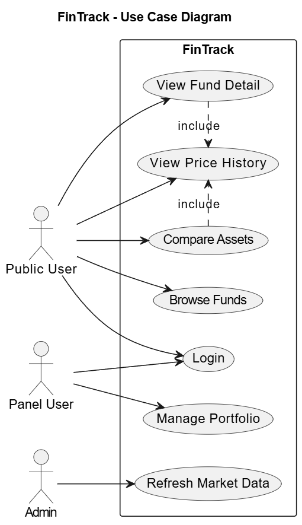
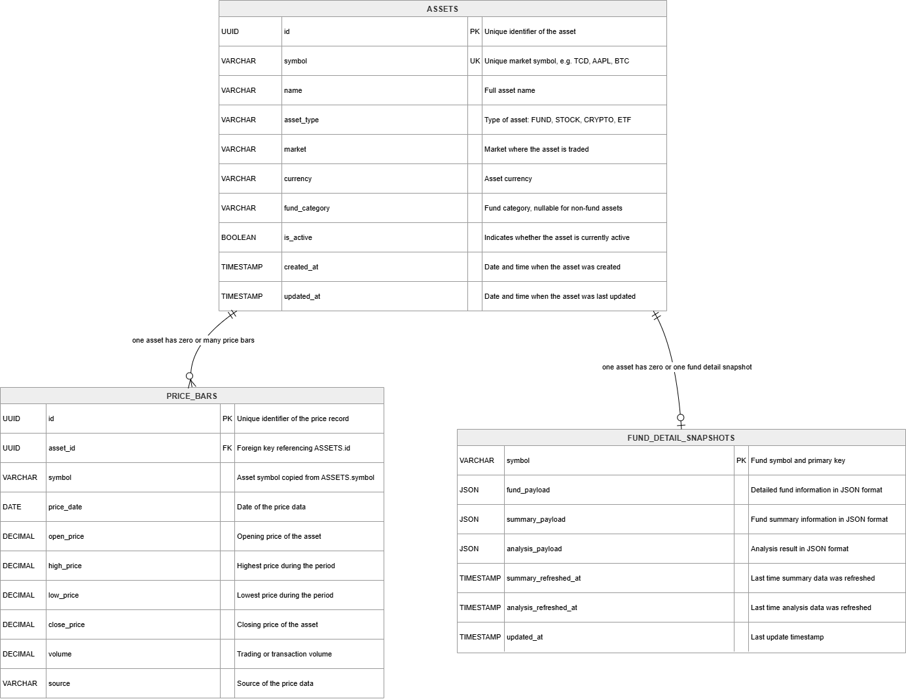

# Лабораторная работа №4

## Тема

**FinTrack: система анализа фондов и финансовых активов**

Идея проекта: приложение помогает пользователю просматривать фонды, анализировать их детали, смотреть историю цен и сравнивать активы между собой.

В рамках лабораторной работы рассматривается применение паттерна **Identity Map**.

---

## Предметная область

FinTrack работает с финансовыми активами:

- инвестиционные фонды;
- акции;
- исторические цены;
- детальная информация по фондам;
- сравнение активов.

Один и тот же актив может использоваться в разных частях системы. Например, пользователь открывает страницу фонда, смотрит его историю цен, затем сравнивает этот же фонд с другим активом. На backend-уровне это может привести к повторной загрузке одной и той же записи из базы данных.

Например, актив с символом `AFT` может быть нужен:

- при отображении карточки фонда;
- при загрузке детальной информации;
- при построении графика цены;
- при сравнении фондов;
- при обновлении сохраненных данных.

Если не контролировать идентичность объектов, одна и та же строка базы данных может быть представлена несколькими независимыми объектами в памяти.

---

## Проблема

Без Identity Map возможна следующая ситуация:

1. Система загружает актив `AFT` из базы данных.
2. Позже в рамках той же операции снова требуется актив `AFT`.
3. Приложение создает новый объект для той же самой записи.
4. В памяти появляются разные объекты, которые логически представляют одну и ту же сущность.

Это может привести к проблемам:

- дублирование объектов в памяти;
- лишние обращения к базе данных;
- сложнее отслеживать изменения;
- риск несогласованности данных перед сохранением;
- сложнее понимать жизненный цикл объектов.

Для финансового приложения это особенно важно, потому что данные должны быть согласованными: цена, фонд, snapshot и история должны относиться к корректной сущности.

---

## Применённый паттерн

В проекте используется паттерн **Identity Map**.

### Краткое описание паттерна

**Identity Map** хранит уже загруженные объекты и гарантирует, что одна и та же запись базы данных в рамках одной сессии соответствует одному управляемому ORM-объекту.

Обычно Identity Map работает как внутренняя таблица:

| Ключ | Значение |
|---|---|
| тип сущности + primary key | объект в памяти |

Например:

| Identity Key | Object |
|---|---|
| `AssetOrm: id=...` | объект `AssetOrm` |
| `PriceBarOrm: id=...` | объект `PriceBarOrm` |

Если объект уже был загружен, session может использовать уже известный объект вместо того, чтобы создавать полностью независимый экземпляр.

---

## Как Identity Map используется в проекте

В моем проекте **нет отдельного класса `IdentityMap`**, реализованного вручную.

Identity Map используется через механизм **SQLAlchemy AsyncSession**. SQLAlchemy Session содержит встроенный Identity Map на ORM-уровне.

То есть паттерн применяется не как отдельная бизнес-сущность, а как часть persistence layer.

Основной поток работы:

1. Application service получает запрос от API.
2. Service обращается к repository.
3. Repository использует `AsyncSession`.
4. `AsyncSession` выполняет запрос к базе данных.
5. ORM-объект загружается и начинает отслеживаться session.
6. SQLAlchemy хранит его identity внутри своей внутренней Identity Map.
7. Repository преобразует ORM-объект в domain object и возвращает его сервису.

---

## Архитектура проекта

В проекте можно выделить несколько логических слоев:

### Application Layer

Содержит сервисы, которые реализуют пользовательские сценарии.

Примеры:

- `FundQueryService`
- `CompareQueryService`

Они отвечают за операции:

- список фондов;
- просмотр деталей фонда;
- история цен;
- сравнение активов.

### Repository Layer

Содержит доступ к данным.

Основной класс:

- `SqlAlchemyAssetRepository`

Он умеет:

- искать актив по символу;
- получать список активов;
- получать историю цен;
- получать snapshot деталей фонда;
- сохранять или обновлять активы.

### Persistence Layer

Содержит ORM-модели и session.

Примеры ORM-моделей:

- `AssetOrm`
- `PriceBarOrm`
- `FundDetailSnapshotOrm`

Именно на этом уровне работает Identity Map, потому что ORM-модели управляются через `AsyncSession`.

### Domain Layer

Содержит domain objects:

- `Asset`
- `PriceBar`
- `FundDetailSnapshot`

Важно: domain objects создаются из ORM-объектов. Поэтому Identity Map в проекте работает на уровне ORM-объектов, а не как отдельная map для domain objects.

---

## Диаграмма классов


Упрощенная версия:


Диаграмма показывает, что сервисы не работают напрямую с базой данных. Они используют repository. Repository работает через `AsyncSession`.

`AsyncSession` содержит внутренний механизм Identity Map. Благодаря этому ORM-объекты, загруженные в рамках одной session, управляются централизованно.

---

## Use Case Diagram



Основные сценарии:

- пользователь просматривает фонды;
- пользователь открывает детали фонда;
- пользователь смотрит историю цен;
- пользователь сравнивает активы;
- пользователь входит в систему;
- panel user управляет портфелем;
- admin обновляет рыночные данные.

Identity Map не является отдельным пользовательским действием. Это внутренний механизм backend-архитектуры, который помогает корректно управлять объектами при выполнении этих сценариев.

---

## Database Schema



В упрощенной схеме используются три основные таблицы:

### `assets`

Хранит основные активы:

- `id`;
- `symbol`;
- `name`;
- `asset_type`;
- `market`;
- `currency`;
- `fund_category`;
- `is_active`.

### `price_bars`

Хранит исторические цены активов:

- `id`;
- `asset_id`;
- `symbol`;
- `price_date`;
- `open_price`;
- `high_price`;
- `low_price`;
- `close_price`;
- `volume`;
- `source`.

Один актив может иметь много записей истории цен.

### `fund_detail_snapshots`

Хранит детальную информацию по фондам:

- `symbol`;
- `fund_payload`;
- `summary_payload`;
- `analysis_payload`;
- `summary_refreshed_at`;
- `analysis_refreshed_at`.

Один фонд может иметь один актуальный snapshot деталей.

---

## Как это работает при демонстрации

Например, пользователь на localhost открывает страницу фонда.

Backend выполняет примерно такой сценарий:

1. Frontend отправляет запрос на получение деталей фонда.
2. Application service вызывает repository.
3. Repository обращается к `AsyncSession`.
4. `AsyncSession` выполняет SQL-запрос.
5. SQLAlchemy получает ORM-объект, например `AssetOrm`.
6. Этот ORM-объект попадает во внутреннюю Identity Map session.
7. Если в рамках той же session этот объект снова понадобится, SQLAlchemy уже знает его identity.
8. Repository возвращает domain object приложению.
9. Пользователь видит данные на странице.

То есть на UI пользователь видит обычную страницу фонда, но внутри backend работает механизм управления идентичностью ORM-объектов.

---

## Почему это важно

Identity Map помогает:

- управлять объектами в рамках одной database session;
- не терять связь между объектом в памяти и строкой в базе данных;
- корректно отслеживать изменения ORM-объектов;
- уменьшить риск дублирования объектов;
- сделать persistence layer более предсказуемым.

В проекте это особенно полезно для сущностей вроде:

- `AssetOrm`;
- `PriceBarOrm`;
- `FundDetailSnapshotOrm`.

Эти объекты представляют важные финансовые данные, поэтому их идентичность должна быть управляемой.

---

## Реализация без паттерна

Без Identity Map repository мог бы каждый раз создавать новый независимый объект для одной и той же записи базы данных.

Например:

1. `get_asset("AFT")` загружает объект `AFT`.
2. Позже `get_asset("AFT")` снова загружает новый объект.
3. Оба объекта представляют один и тот же актив.
4. Если один объект был изменен, второй об этом не знает.
5. Перед сохранением могут возникнуть проблемы с согласованностью.

В таком варианте persistence layer становится менее контролируемым.

---

## Особенность моей реализации

В проекте Identity Map не написан вручную.

Я использую готовый механизм SQLAlchemy:

```python
SessionLocal = async_sessionmaker(
    bind=engine,
    expire_on_commit=False,
    class_=AsyncSession
)
Repository получает объект `session` через конструктор:

```python
class SqlAlchemyAssetRepository:
    def __init__(self, session: AsyncSession) -> None:
        self._session = session
```

Далее все запросы к базе данных выполняются через эту `session`:

```python
result = await self._session.execute(stmt)
```

Именно `SQLAlchemy Session` управляет ORM-объектами и содержит внутреннюю **Identity Map**.

## Ограничение

Важно уточнить, что **Identity Map работает на ORM-уровне**.

После загрузки ORM-моделей repository преобразует их в domain objects:

- `AssetOrm` → `Asset`;
- `PriceBarOrm` → `PriceBar`;
- `FundDetailSnapshotOrm` → `FundDetailSnapshot`.

Поэтому в проекте нет отдельной Identity Map для domain objects. Это является осознанным архитектурным решением, так как управление идентичностью уже выполняется на уровне persistence layer с помощью `SQLAlchemy Session`.

## Вывод

Внедрение Identity Map через `SQLAlchemy Session` положительно влияет на архитектуру проекта.

Данный механизм позволяет:

- централизованно управлять ORM-объектами;
- связывать объект в памяти с конкретной строкой базы данных;
- уменьшить риск дублирования данных;
- упростить сохранение изменений;
- сделать работу repository более надежной.

Для пользователя Identity Map не является отдельной функцией интерфейса. Это внутренний механизм backend-части приложения, который помогает системе стабильнее работать с финансовыми данными и делает persistence layer более предсказуемым.

В рамках проекта `FinTrack` Identity Map используется неявно через `AsyncSession`, что соответствует архитектуре ORM-based приложения.
